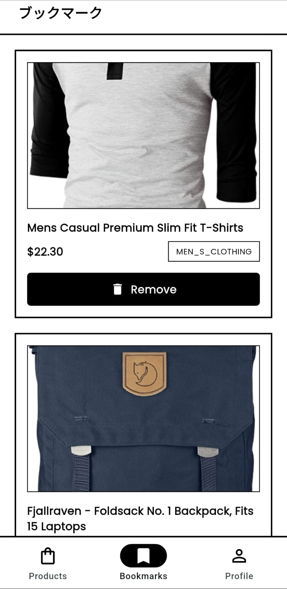
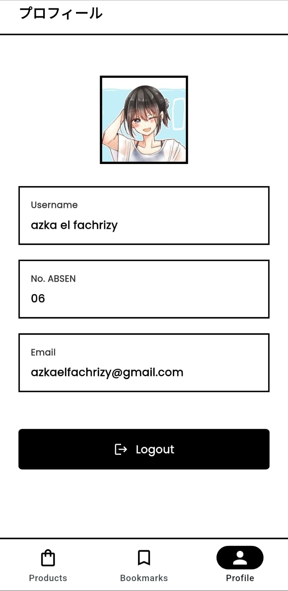

# Product Store App - PAS MOBILE DEV ABSEN 06

A simple Flutter application hitting multiple API with GetX state management implementing user authentication, product listing, bookmarking system, and user profile management using brutalist design aesthetic.
## SNEAK PEAK APP



## Project Overview

This application demonstrates:
- User Registration and Login with token-based authentication
- Product listing from FakeStore API
- Product bookmarking with local SQLite database
- User profile management
- Splash screen with login status checking
- GetX state management
- Brutalist UI design aesthetic

## Architecture

### State Management
- **GetX (get: ^4.7.2)** - Reactive state management and routing

### Project Structure
```
lib/
├── main.dart                 # App entry point with GetMaterialApp
├── bindings/                 # GetX dependency injection
├── controllers/              # GetX controllers
├── models/                   # Data models
├── pages/                    # UI screens
├── routes/                   # Navigation configuration
├── networks/                 # API client
├── helper/                   # Database and SharedPreferences
└── widgets/                  # Reusable components
```

## 🔑 Key Features

### 1. Authentication System
- **Register**: Create account (API: `https://mediadwi.com/api/latihan/register-user`)
- **Login**: Authenticate with token saved to SharedPreferences (API: `https://mediadwi.com/api/latihan/login`)
- **Logout**: Clear all user data

### 2. Product Management
- List all products from FakeStore API (`https://fakestoreapi.com/products`)
- Bookmark products to local SQLite database
- Display: image, title, price, rating, category

### 3. Favorites Management
- View all bookmarked products
- Remove individual bookmarks
- Pull-to-refresh

### 4. User Profile
- Display username, email, full name
- Avatar with user initial
- Logout with confirmation

### 5. Splash Screen
- Checks login status on app start
- Routes to appropriate screen

## Data Storage

**SharedPreferences:** auth_token, username, email, full_name
**SQLite:** Favorites table with product details

## Design - Brutalist Aesthetic
- Heavy black borders (2-3px)
- Minimal palette (black, white, gray)
- Bold uppercase typography with 1-2px letter spacing
- Maximum contrast and clarity

## Dependencies
```yaml
get: ^4.7.2                # State management & routing
shared_preferences: ^2.2.3 # Local preferences
sqflite: ^2.3.4            # Database
http: ^1.2.1               # API calls
path: ^1.9.0               # Database paths
```

## Quick Start
```bash
flutter pub get
flutter run
```

## Screens
1. Splash Screen
2. Login Screen
3. Register Screen
4. Products Screen (with bookmark)
5. Bookmarks Screen
6. Profile Screen

## GetX Controllers
- **AuthController** - Registration, login, logout
- **ListprodukController** - Product fetching and bookmarking
- **FavoriteController** - Favorite management
- **ProfileController** - User info and logout
- **BottomNavController** - Tab navigation
- **SplashscreenController** - Login status check

---

**Created for:** PAS Mobile 11 PPLG1 06 | **Framework:** Flutter + GetX | **Design:** Brutalist
